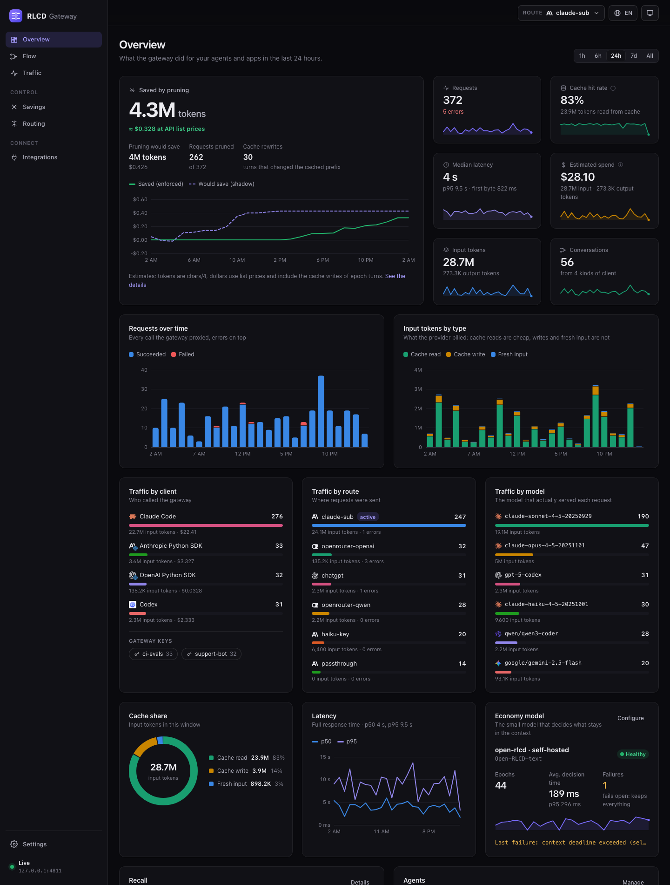
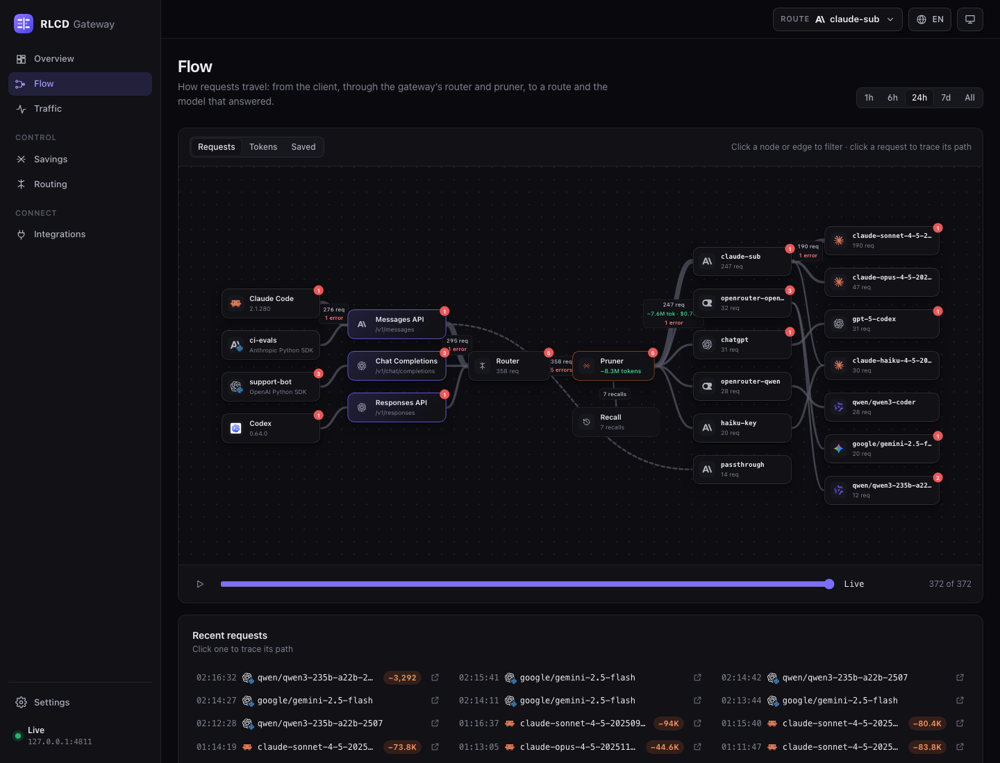
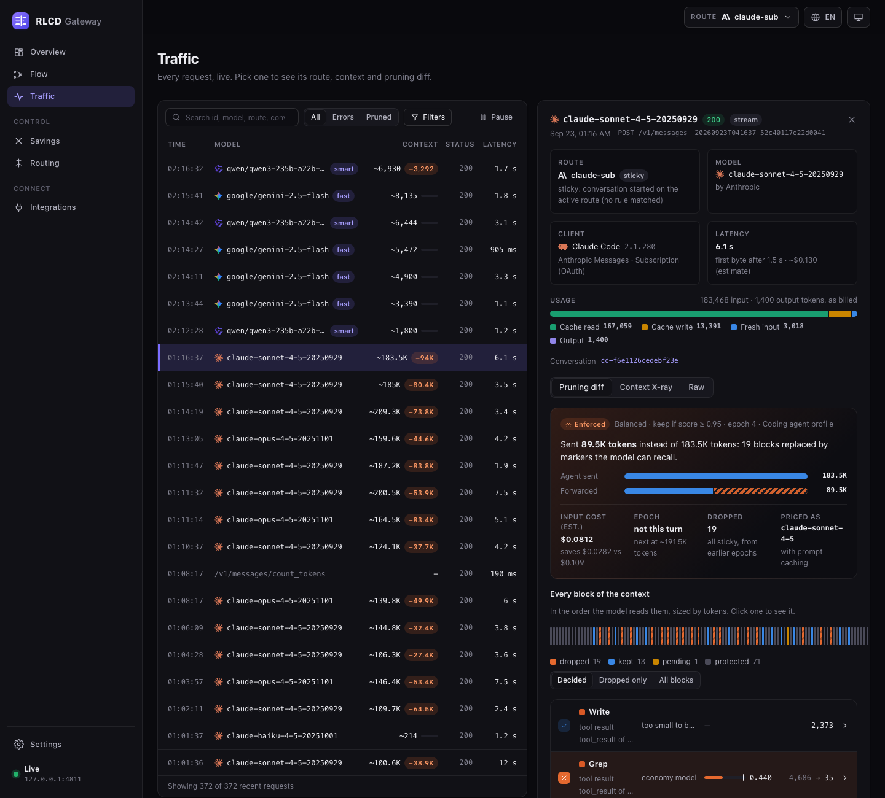

# RLCD Gateway

An LLM gateway for coding agents (Claude Code, Codex, OpenCode) and for any app
that uses an OpenAI or Anthropic SDK. Point the client's base URL at it: the
gateway routes each call to the provider you choose (Anthropic, OpenRouter,
OpenAI, Groq, Together, DeepSeek, Mistral, Ollama, vLLM, LM Studio…), prunes
the context the model no longer needs, and returns the provider's response
untouched, streaming included. The dashboard shows exactly what every call
sent, who sent it, where it went and what it cost.

```
Claude Code ─────┐                        ┌─► api.anthropic.com  (your own login, forwarded as-is)
Codex, OpenCode ─┼─► RLCD Gateway :4777 ──┼─► openrouter.ai      (a key the gateway holds)
your chatbot ────┘    │                   └─► groq, ollama, …    (any OpenAI-compatible API)
 (OpenAI SDK)         └─ dashboard http://127.0.0.1:4777/ui/
```




| Flow | Request inspector |
|---|---|
|  |  |

<sub>Screenshots use synthetic demo data, not measured results. The dashboard is available in English, Português (Brasil) and Español.</sub>

## How it intercepts

It uses no system proxy and no certificates. You point the agent's **base URL** at the
gateway, and the agent keeps its own login, whether that is a subscription or an API key.
For every request the gateway picks the active route:

- **passthrough** routes forward the client's credentials untouched, so a Claude
  subscription is still what serves the turn.
- **key** routes drop the client's credentials and use a key the gateway holds,
  optionally swapping the model (e.g. OpenRouter).

You can switch routes from the dashboard mid-session; the agent never notices.
When a turn crosses providers, signed `thinking` blocks are removed because
they only validate on the model that wrote them.

Every model call runs the same pipeline whatever its protocol: Anthropic
Messages (`POST /v1/messages`), OpenAI Chat Completions
(`POST /v1/chat/completions`) and OpenAI Responses (`POST /v1/responses`, also
under `/openai/v1`). A model alias or a rule picks the route, pruning runs,
then the route's shaping, and the call is forwarded in its own protocol. The
gateway never translates between protocols: a route of kind `anthropic` or
`openrouter` serves Anthropic Messages, a route of kind `openai` serves the two
OpenAI formats, and a configuration that would cross them is refused with a
clear error. (OpenRouter serves Claude models over the OpenAI format too, at
`https://openrouter.ai/api/v1`, so an OpenAI SDK can reach Claude through an
`openai` route.)

## Use it from any app

Set the SDK's base URL to the gateway and use a model alias (see Routing) or
any model name the route's provider knows:

```python
from openai import OpenAI

client = OpenAI(base_url="http://127.0.0.1:4777/v1", api_key="rlcd-…")
reply = client.chat.completions.create(
    model="smart",
    messages=[{"role": "user", "content": "Hello"}],
)
print(reply.choices[0].message.content)
```

```js
import OpenAI from "openai";

const client = new OpenAI({ baseURL: "http://127.0.0.1:4777/v1", apiKey: "rlcd-…" });
const reply = await client.chat.completions.create({
  model: "smart",
  messages: [{ role: "user", content: "Hello" }],
});
```

```bash
curl http://127.0.0.1:4777/v1/chat/completions \
  -H "Authorization: Bearer rlcd-…" -H "Content-Type: application/json" \
  -d '{"model": "smart", "messages": [{"role": "user", "content": "Hello"}]}'
curl http://127.0.0.1:4777/v1/models -H "Authorization: Bearer rlcd-…"   # the aliases
```

```python
import anthropic

client = anthropic.Anthropic(base_url="http://127.0.0.1:4777", api_key="rlcd-…")
message = client.messages.create(model="claude-sonnet-4-5", max_tokens=1024,
                                 messages=[{"role": "user", "content": "Hello"}])
```

Most tools also read `OPENAI_BASE_URL=http://127.0.0.1:4777/v1` or
`ANTHROPIC_BASE_URL=http://127.0.0.1:4777`. The dashboard's Apps tab fills
these snippets in with your address, aliases and key.

`rlcd-…` is a gateway key (see Gateway keys): the app never holds a provider
key. On loopback a key is optional, and an app can send its own provider key
instead, which a `passthrough` route forwards. An OpenAI-format call that no
alias or rule claims goes to `default_openai_route`, or, when that is unset,
to OpenAI or the ChatGPT backend depending on the client's own login (as
Codex needs). Other OpenAI endpoints under `/openai/v1` (and
`POST /v1/embeddings`) are passed through to that same default without
routing or pruning.

`GET /v1/models` and `GET /openai/v1/models` list the aliases in a shape both
SDK families read (OpenAI's `{object: "list", data: [{id, object, created,
owned_by}]}` with Anthropic's `type`, `display_name`, `created_at`,
`has_more`, `first_id` and `last_id` alongside). They answer from the gateway
for gateway-key clients and, once aliases exist, for other OpenAI clients; an
Anthropic SDK (`anthropic-version` header) or a ChatGPT login still gets its
provider's own list, as before.

Every request record names the client (`client`: `{id, name, version, kind,
key_name}`, detected from the User-Agent, `X-Stainless-*`, `originator` and
Claude Code's headers; ids such as `claude-code`, `codex`, `opencode`,
`openai-python`, `anthropic-node`, `curl`), the `provider` behind the route
(explicit, or from the base URL host: `anthropic`, `openrouter`, `openai`,
`groq`, `together`, `deepseek`, `mistral`, `google`, `ollama`, `vllm`,
`lmstudio`, `custom`), the `model_vendor` of the model sent (`qwen/qwen3-…` →
`qwen`), the gateway key, and an estimated cost.

## Economy model

Pruning is decided by a System One model that answers per block
key and never rewrites text. Jev and open-rlcd share the same API
(`POST /v1/systemone`), so the backend is just configuration:

| Backend | Base URL | Token |
|---|---|---|
| `open-rlcd-local` | wherever you run it | optional |
| `open-rlcd-cloud` | hosted open-rlcd | required |
| `jev` | `https://api.typesafe.ai` | TypeSafe token |


The pruner picks a **profile** per request (`profile`: `auto`, `agent`, `chat`).
`auto` uses `agent` for coding agents and Anthropic-format calls and `chat` for
OpenAI-format apps: a chat app's answered questions are history, so its goal is
only the current question (`goal_turns: 1`) and the selector is asked whether the
*current* question needs a block. Explicit `criteria` or `goal_turns` still win.

On macOS, `.local` names resolve through mDNS and occasionally miss; the selector
retries once, but an IP address or an `/etc/hosts` entry is more reliable.

## Decisions (System One) proxy

System One models answer typed questions about a state instead of writing text.
TypeSafe's Jev (`https://api.typesafe.ai`) and open-rlcd (self-hosted) share one
API, `POST /v1/systemone`. An app that makes these calls only changes its base URL
to the gateway: it gets the backend's answer byte for byte, headers included
(open-rlcd's `x-rlcd-forward-ms` and `x-rlcd-total-ms` too), and every call is
logged for audit. `POST /v1/decisions` is an alias. The paths are not repeated
under `/openai/v1`: that prefix is the OpenAI base URL, and no System One client
builds its URL from it.

```bash
curl http://127.0.0.1:4777/v1/systemone -H "Content-Type: application/json" \
  -H "Authorization: Bearer rlcd-…" -d '{
  "model": "Open-RLCD-text",
  "state": {"ticket": {"subject": "Charged twice", "body": "I want a refund for Pro."}},
  "questions": {
    "intent":  {"type": "choice", "instructions": "What does the customer want?",
                "criteria": {"billing": "charges and refunds", "shipping": "delivery", "other": "anything else"}},
    "urgency": {"type": "score", "instructions": "How urgent?", "criteria": ["low", "medium", "high"]},
    "refund":  {"type": "noul", "instructions": "Explicitly asks for a refund?"}}}'
```

```python
import requests

GATEWAY = "http://127.0.0.1:4777"   # was https://api.typesafe.ai or your open-rlcd
r = requests.post(f"{GATEWAY}/v1/systemone",
                  headers={"Authorization": "Bearer rlcd-…"},   # a gateway key
                  json={"model": "jev-latest", "state": state, "questions": questions})
answers = r.json()["answers"]
request_id = r.headers["X-Rlcd-Request-Id"]   # for recording the outcome later
```

**Backends.** The `decisions` section of the config (dashboard, or
`GET|PUT /api/decisions/settings`) names the System One servers and maps models to
them. With no section at all, every call goes to the economy model's backend
(`economy`, from `selector`), so it works out of the box.

```json
"decisions": {
  "backends": {
    "jev":       {"base_url": "https://api.typesafe.ai", "auth": "passthrough"},
    "open-rlcd": {"base_url": "http://open-rlcd.idie.local", "auth": "key"},
    "rlcd-cloud": {"base_url": "https://rlcd.example.com", "auth": "key", "token_env": "OPEN_RLCD_API_KEY"}
  },
  "default_backend": "open-rlcd",
  "models": {"jev-latest": "jev", "jev-preview": "jev",
             "Open-RLCD-text": "open-rlcd", "Open-RLCD-vision": "open-rlcd", "rlcd-cloud-*": "rlcd-cloud"},
  "mirror": {"backend": "jev", "sample_rate": 0.1, "model": "jev-latest"},
  "log_internal": true
}
```

- `auth: key` drops the client's credentials and sends the backend's `token` (or
  `token_env`; none at all for an open-rlcd that needs none). `auth: passthrough`
  forwards the client's own `Authorization`, e.g. its TypeSafe key.
- A model maps by exact name, then by the longest `prefix*`; any other model goes to
  `default_backend` (`economy` when unset).
- The API never returns a token, only `has_token`. On `PUT`, an empty token keeps the
  stored one and `"clear_token": true` removes it. Everything is validated; a
  section that does not validate refuses decision calls rather than guessing.

**Gateway keys** work as on every proxy path: a key authenticates the call, its
requests-per-minute and daily token limits apply, usage and cost are charged to it, and
it is stripped before forwarding. Listening beyond loopback, a key is required. A key
limited to some models (`aliases`) or routes also limits decision models and backend
names. A `passthrough` backend needs the client's own login, so a gateway-key client
sends its key in `X-Rlcd-Key` next to its TypeSafe key.

**The record.** Each call appears in Traffic with protocol `systemone`: the client,
the conversation id (from `Conversation-Id`, `Session-Id` or `X-Rlcd-Conversation-Id`),
latency with the backend's forward and total ms, usage, and an estimated cost. Jev is
priced from TypeSafe's published rate, $42 per billion input tokens with output not
charged (checked 2026-09); self-hosted open-rlcd costs $0. Both are rows (`jev`,
`open-rlcd`) of the price table and can be overridden. The X-ray shows the state's
size and one block per question (key, type, criteria labels). The record also carries
a compact `decisions` summary: per question its type, the answer (the choice, `yes`/`no`
for noul, the legend label of the rounded score), the confidence (for noul, which has
none, `max(noul, 1 - noul)` as in the Open-RLCD labs) and the top probability. Bodies
follow the storage `bodies` policy.

**Audit API.**

| Endpoint | |
|---|---|
| `GET /api/decisions` | newest first; `limit` (≤ 500) and `cursor` (the previous page's `next_cursor`) |
| `GET /api/decisions/export?format=csv\|jsonl` | streamed, oldest first; CSV has one row per question |
| `GET /api/decisions/stats` | per question: counts, answers, confidence histogram, accuracy, ECE; p50/p95 latency and error rate in total, by backend, model and source; mirror agreement |
| `POST /api/decisions/{request_id}/outcome` | `{"question": "intent", "outcome": "billing"}` records the ground truth |

All three reads take the same filters: `from`, `to` (RFC 3339, a date or unix
seconds), `since` (`24h`, `7d`), `question`, `model`, `backend`, `client`, `key` (id
or name), `answer`, `source` (`client`, `prune`, `router`), `status` (`ok`, `error`),
`outcome` (`with`, `without`) and `confidence_below`, which lists the unsure decisions:
`/api/decisions?question=intent&confidence_below=0.6`.

**Calibration.** Record what actually happened, when you know it:

```bash
curl -X POST http://127.0.0.1:4777/api/decisions/20260923T131055-66f12aba0b8780c6/outcome \
  -d '{"question": "refund", "outcome": false}'
```

The outcome is a criteria label for `choice`, `true`/`false` for `noul` and the legend
index or label for `score`; `null` removes it. An answer is correct when it is the
same choice, on the same side of 0.5, or a score within 0.5 of the outcome. Stats then
report, per question, the accuracy and the ECE (expected calibration error over 10
equal-width confidence bins), with each bin's count, mean confidence and accuracy:
with few outcomes per bin the ECE is noisy, so read the counts too.

**Mirror.** `mirror: {backend, sample_rate, model?}` (off by default) sends a sampled
copy of each successful client call to a second backend, for example open-rlcd traffic
to Jev, *after* the client has its answer, so it never adds latency. `model` replaces
the model on the copy. The result is kept next to the call: both answers and
confidences per question, both latencies, and whether they agree (the same answer
string). Stats report the agreement rate overall, per mirror backend and per question.
That is the drop-in parity audit.

**The gateway's own decisions.** Pruning and the router's auto rule ask the economy
model too. With `log_internal` (on by default) those calls are logged as decisions
of client `rlcd-gateway`, with `source` `prune` or `router` and `parent_id` naming the
turn they served. Logging happens off the request path, through a bounded queue: it
never adds latency or fails a turn, and when the queue is full or storing fails, it
only moves a counter (`internal` in the stats).

## Pruning

Before each model call is forwarded (any protocol), the gateway looks at the old blocks of the
context and replaces the ones the current goal no longer needs with a marker:

```
[rlcd: ~1027 tokens omitted · key toolu_01Ab… · req 20260923T041241-… · call rlcd_recall to restore]
```

The marker names the request whose logged body still holds the original, so the model can
get it back through `rlcd_recall`. A dropped `tool_result` keeps its `tool_use_id` and
`is_error`; only its content changes. The latest turns, signed thinking blocks, tool calls,
and recall results are never touched.

It starts in **shadow** mode: every decision is computed and shown in the request view
("would have saved…"), but the agent's request is forwarded untouched. Switch to
**enforce** in the Pruning tab once the decisions look right. Enforcing needs
`log_bodies`, because recall reads the logged bodies.

Decisions come from free deterministic rules first (keep errors and edit results, drop a
file read that is read again later, skip small blocks), then from one batched selector
call that answers a keep probability per block key. If the selector fails or takes longer
than `selector_timeout_ms` (3 s), everything is kept.

**Prompt caching.** Anthropic bills cached prefix reads at about 0.1× input and cache
writes at 1.25×, and any change invalidates everything after it. A pruner that edits
the prefix every turn therefore costs more than it saves. To avoid that:

- Decisions are sticky per conversation and survive restarts (`<home>/prune/`). A dropped
  block is replaced by the byte-identical marker on every later turn. A kept block is
  not asked about again.
- New decisions are only taken in **epochs**: when the context has grown by
  `epoch_tokens` since the last epoch, and is above `floor_tokens`. An epoch only
  considers blocks that appeared since the previous one. The prefix before them stays
  cached, and only the tail from the first new drop is written again, once.
- Blocks are identified by `tool_use_id` or a content hash, not by position, so they
  are recognised again after the agent compacts.

The trade-off is that a block kept at one epoch is never reconsidered, even if it later
becomes stale. Dropping it would rewrite the cache from that point on: for a 1k-token
block with 50k tokens after it, the rewrite costs as much as hundreds of turns of
savings. Pruning tool definitions or system sections (`prune_tools`, `prune_system`,
both off by default) changes the very start of the prompt, so the dashboard warns about it.

Every report prices the turn with and without pruning, cache reads and writes included,
using a per-model price table you can override (Anthropic and OpenAI-compatible list
prices as of 2026-06, labelled as estimates). Token counts are chars/4 estimates. Epoch
turns can cost more than they save, so savings can be negative early in a session.

The cost model follows the protocol. OpenAI-format providers cache prompt prefixes on
their own (from 1024 tokens on OpenAI) with cached input discounted and no write
premium, so an uncached token is priced at plain input rather than 1.25×; the
estimate assumes the same rule for every OpenAI-compatible provider. Local servers are
priced by the `default` row unless you add a zero row for their models.

**OpenAI formats.** Chat Completions and Responses requests are pruned with the same
invariants. The tool results are `role: "tool"` messages (`tool_call_id`) and
`function_call_output` items (`call_id`); only their output becomes the marker (a string
stays a string, a list of parts becomes one text part), and every call keeps its output.
Assistant `tool_calls`, `function_call` and `reasoning` items, images, files and tool
definitions are never touched, and the rewritten body is checked field by field against
the original before it is forwarded: nothing outside the message list may change. Call
ids that repeat within a conversation (some servers number them per response) are keyed
by content and named by block key in their markers. A compaction request
(`/responses/compact`) is routed but never pruned.

Plain chatbot conversations have no tool output. For them `prune_conversation_text`
(off by default) makes long user and assistant messages older than `keep_last_n_turns`
candidates too; `always_keep_user_text` still protects user text. It is off because
dropping old turns changes what the model remembers of the conversation, and a chat app
usually has no recall tool to get them back. Anthropic text blocks are candidates as
before.

Mark any decision as "should have kept" or "should have dropped" in the request view.
The Pruning tab replays those cases against the current criteria and threshold, which
works as a regression suite for criteria changes. Every block the model got back with
`rlcd_recall` is a case too ("recall" in the list, verdict "should keep", with the
snapshot of the request that dropped it), and it is never dropped again in that
conversation. A drop that was already sent stays as its marker: restoring it would
rewrite the cached prefix, and the recall result already holds the content.

API, under `/api/prune`: `GET|PUT config`, `GET presets`, `GET|POST feedback`,
`DELETE feedback/{id}` (not for recall cases), `POST replay`, `GET stats`.

## Run

```bash
make build                       # frontend -> embedded -> bin/rlcd-gateway
./bin/rlcd-gateway               # proxy + dashboard on 127.0.0.1:4777
ANTHROPIC_BASE_URL=http://127.0.0.1:4777 claude   # try it without changing settings
OPENAI_BASE_URL=http://127.0.0.1:4777/v1 python my_app.py   # any OpenAI SDK app
./bin/rlcd-gateway help          # every command and option
```

## Agents

Every agent is pointed at the gateway through its base URL only; its login is not
touched. Try the one-off command first. `rlcd-gateway setup <agent>` makes it permanent
and `rlcd-gateway undo <agent>` puts back exactly what was there before. The dashboard's
Agents tab shows the same status and buttons (each asks for confirmation).

| Agent | Try it once | `setup` changes |
|---|---|---|
| Claude Code | `ANTHROPIC_BASE_URL=http://127.0.0.1:4777 claude` | `env.ANTHROPIC_BASE_URL` in `~/.claude/settings.json` |
| Codex CLI | `codex -c model_provider=rlcd_gateway -c 'model_providers.rlcd_gateway={name="RLCD Gateway", base_url="http://127.0.0.1:4777/openai/v1", wire_api="responses", requires_openai_auth=true, supports_websockets=false}'` | the same provider, in two marked blocks of `~/.codex/config.toml` |
| OpenCode | `OPENCODE_CONFIG_CONTENT='{"provider":{"anthropic":{"options":{"baseURL":"http://127.0.0.1:4777/v1"}},"openai":{"options":{"baseURL":"http://127.0.0.1:4777/openai/v1"}}}}' opencode` | `provider.anthropic` / `provider.openai` `options.baseURL` in `~/.config/opencode/opencode.json` |

Every edit keeps the rest of the file, writes a timestamped backup next to it first, and
refuses a file it cannot parse (for example an OpenCode `.jsonc` with comments). The
previous value of each key is kept in `~/.rlcd-gateway/agents/`, so undo restores it
instead of just deleting the key; an untouched file comes back byte for byte.

**Claude Code.** A subscription stays a subscription: the gateway forwards the login
unchanged. The Agents tab shows which settings level is in effect, because a higher one
wins over `~/.claude/settings.json`: managed settings, then `.claude/settings.local.json`,
then `.claude/settings.json` in the project. An `env` value in any settings file also wins
over the same variable exported in the shell
([settings](https://code.claude.com/docs/en/settings),
[env vars](https://code.claude.com/docs/en/env-vars)). It also shows which credential
Claude Code will send, in its documented order: Bedrock/Vertex/Foundry (which bypass the
base URL), `ANTHROPIC_AUTH_TOKEN`, `ANTHROPIC_API_KEY`, `apiKeyHelper`,
`CLAUDE_CODE_OAUTH_TOKEN`, then the `/login` subscription
([authentication](https://code.claude.com/docs/en/authentication)). Values are never shown.

**Codex CLI.** The built-in `openai` provider can't be redefined and always tries
WebSockets first, so setup adds a custom provider. `requires_openai_auth = true` makes
Codex send its own login, and a custom `base_url` is honoured for a **ChatGPT
subscription** login as well as for an API key
([config reference](https://learn.chatgpt.com/docs/config-file/config-reference),
[provider source](https://github.com/openai/codex/blob/main/codex-rs/model-provider-info/src/lib.rs)).
The gateway tells the two apart by the credential. A ChatGPT token plus
`ChatGPT-Account-ID` goes to `https://chatgpt.com/backend-api/codex`. An API key goes to
`https://api.openai.com/v1`. Both upstreams can be changed in the `adapters` section of
the config (`openai_base_url`, `chatgpt_base_url`). Codex's own `chatgpt_base_url` setting
only covers the login flow, not model traffic.

**OpenCode.** Its `anthropic` provider uses the gateway's Anthropic path, so it gets
everything Claude Code gets. OpenAI API keys go through the Responses adapter. OpenCode's
ChatGPT Plus/Pro login is different. Its plugin sends every request to
`chatgpt.com/backend-api/codex/responses` and ignores `baseURL`. That traffic can't be
redirected, and only a TLS-intercepting proxy could see it, which this project does not
build.

Codex and OpenAI-format traffic shows up in the Traffic tab with usage and the Context
X-ray, and is routed and pruned like the Anthropic path.

Development uses two terminals: `make dev-gateway`, and `make dev-ui` (Vite on :5177,
with `/api` forwarded to the gateway).

Config and logs live in `~/.rlcd-gateway/`, or in `$RLCD_GATEWAY_HOME` if set. Logs
contain full prompts; set `"log_bodies": false` to keep summaries only. Details are
kept 14 days by default, within 2 GB (see Storage and retention).
Credentials are masked in logs and are never returned by the dashboard API.
On loopback the gateway only accepts requests addressed to the loopback host and port it
is bound to; see Gateway keys for listening beyond this machine.

## Gateway keys

A gateway key (`rlcd-` followed by 64 hex characters) lets an app call the gateway
without holding any provider key. Create one in the Keys tab or with
`rlcd-gateway keys create <name> [-rpm N] [-tokens-per-day N] [-aliases a,b] [-routes r,s]`.
It is shown once. The gateway stores only its SHA-256 hash (in `keys.json`, mode 600):
the key is 256 random bits, so a slow password hash would add nothing.

An app sends the key where its SDK sends an API key (`Authorization: Bearer`,
`x-api-key` or `api-key`). The gateway checks it, removes it, and the route injects its
own provider key, so neither the provider nor the request log ever sees the gateway key.
A route that forwards the client's own login (a Claude subscription) cannot serve a
request that only carries a gateway key; the client then sends its login as usual and
the gateway key in `X-Rlcd-Key`. Each key can be limited to some aliases and routes, to
requests per minute (checked before forwarding; `429` with `Retry-After`) and to tokens
per UTC day (checked before forwarding against what earlier calls used, so the call that
crosses the limit still completes). Usage and estimated cost are kept per key and shown
in the Keys tab, in `GET /api/stats` (`by_key`) and on every request. Conversation ids,
and with them pruning decisions and routing pins, are scoped to the key, and
`rlcd_recall` called with a key only reaches that key's requests.

**Listening beyond this machine.** The listen address decides the mode:

- *Loopback* (`127.0.0.1:4777`, the default): as before. Requests must be addressed to
  the loopback host and port the gateway is bound to (which stops DNS rebinding). Keys
  are optional: a request carrying one is checked, one without is forwarded with the
  client's own login. `"require_keys": true` (or the switch in the Keys tab) makes keys
  mandatory anyway.
- *Exposed* (`-listen 0.0.0.0:4777`, or any non-loopback address): every request to
  `/v1`, `/openai` and `/mcp` needs a valid gateway key. The `Host` must be an IP
  address, `localhost`, or a name in `allowed_hosts` (config) or `-allow-host`; any
  other name is refused, which is what a DNS-rebinding page would send. The dashboard
  and `/api` are only served to a browser on the gateway's own machine (loopback peer
  and loopback `Host`), or to requests carrying the admin token from
  `RLCD_GATEWAY_ADMIN_TOKEN` (24 characters or more), as `Authorization: Bearer` or as
  the HttpOnly, SameSite=Strict session cookie the dashboard's login form gets from
  `POST /auth/admin` (the cookie holds a hash of the token). Without an admin token
  there is no remote dashboard at all. A gateway key never opens the dashboard.

In both modes a state-changing dashboard request from another site's page (a foreign
`Origin`) is refused. The gateway speaks plain HTTP: beyond a trusted network, put it
behind a TLS-terminating reverse proxy on another host, since a proxy on the same host
would make every request look local to the dashboard check.

API: `GET|POST /api/keys`, `PUT /api/keys/{id}`, `POST /api/keys/{id}/revoke`,
`PUT /api/require-keys`.

## Routing

Routes have a kind: `anthropic` (api.anthropic.com), `openrouter` (OpenRouter's
Anthropic-compatible endpoint), or `openai` for any OpenAI-compatible API, whose base URL
is the one an OpenAI SDK takes (`https://openrouter.ai/api/v1`, `https://api.openai.com/v1`,
`https://api.groq.com/openai/v1`, `http://127.0.0.1:11434/v1` for Ollama, …). A route can
add headers to every upstream call (OpenRouter's `HTTP-Referer` and `X-Title`); they are
shown in the dashboard, so keys belong in `api_key` or `api_key_env`. The active route
(top bar) serves Anthropic requests; `default_openai_route` serves OpenAI ones.

**Model aliases** map the model name a client asks for (`smart`, `gpt-4o`) to a route and
an upstream model. An alias match is the simplest rule: it is checked before the rules
and never pins a conversation, since the client names it on every turn. An alias only
serves requests in its route's protocol; asking for it in the other one is a clear `400`.
`GET /v1/models` lists the aliases.

Without rules, the active route serves every request. With rules (dashboard, Routing
tab), each request is routed on its own: the first enabled rule whose conditions all
hold picks the route, and no match means the active route. Conditions cover the client
model (regex), estimated context size, tools, images, thinking, `max_tokens`, request
headers, the conversation id, and **background requests**.

Background requests are the side calls Claude Code makes next to the main loop:
quota probes (`max_tokens: 1`) and one-shot queries such as session titles and
tool-use summaries, which send no tools, no thinking, a single message and no
`cache_control`. Main-loop and subagent turns always carry tools and cache markers,
so they never match.

Decisions are **sticky per conversation** by default. The first decision of a
conversation holds for all its turns, because switching model halfway discards the
provider's prompt cache and invalidates signed thinking blocks. Pins live in
`router/sticky.json`, survive restarts and expire after a quiet period. Background
requests never create a pin and can bypass it. Only rules marked "override stickiness"
can move a pinned conversation.

An **auto rule** asks the economy model to pick among routes that have a description
("fast cheap model for simple questions", "strongest model for complex refactors").
It runs only at conversation start, with a short timeout. On any failure the next rule
decides. The economy model only picks a key; it never writes text.

Rules can be limited to a protocol (`when.protocol`: `anthropic-messages`, `openai-chat`,
`openai-responses`, or `openai` for both). A rule that can only meet a protocol its route
does not speak is refused when saved; at run time a rule (or a sticky pin) whose route
speaks another protocol is skipped with that reason. Background detection only applies to
Anthropic requests: a plain chat completion without tools is an ordinary turn.

Every decision is logged with a one-line reason (`alias 'smart' → route 'groq'`,
`rule 'background' matched: …`, `sticky: conversation started on 'claude-sub'`). The dry
run replays any logged request, of any protocol, through the same code and shows why
each rule matched or not.

API, under `/api/router`: `GET|PUT rules`, `GET routes`, `PUT|DELETE routes/{name}`,
`GET|PUT aliases`, `PUT openai-default`, `POST dryrun`, `GET|DELETE conversations`.

## Recall

When pruning omits a block, the model sees a marker in its place:

```
[rlcd: ~1200 tokens omitted · key toolu_01A09q90… · req 20260923T010203-0a1b2c3d4e5f6a7b · call rlcd_recall to restore]
```

The gateway serves an MCP server at `http://127.0.0.1:4777/mcp` (Streamable HTTP,
protocol revision 2026-07-28, and the `initialize`-based 2025-11-25, 2025-06-18 and
2025-03-26 revisions for older clients). Its one tool, `rlcd_recall`, takes the `key`
and `req` from a marker (or the whole `marker`) and returns the original content from
the logged request body. Register it once with Claude Code:

```bash
claude mcp add --transport http --scope user rlcd-gateway http://127.0.0.1:4777/mcp
```

The model then sees the tool as `mcp__rlcd-gateway__rlcd_recall`. Recall needs
`"log_bodies": true`, and resolves markers in Anthropic and OpenAI-format bodies alike.
An app without an MCP client cannot recall, so enforced pruning is lossy for it. Settings live in the `recall` section of the config
(`enabled`, default true; `max_bytes` per recall, default 100000, larger content is
truncated with a notice).

Every recall is appended to `recall/events.jsonl` in the config directory. A recall
means pruning dropped something the model needed, so events are the pruner's
"should keep" feedback. One JSON object per line; fields are only ever added:

| Field | Meaning |
|---|---|
| `time` | when the tool was called |
| `conversation_id` | conversation of the request the content came from |
| `req`, `key` | what the model asked for |
| `block_key`, `tool_use_id`, `tool`, `kind` | the block it resolved to |
| `tokens`, `bytes`, `truncated` | estimated size of the original; bytes returned |
| `ok`, `error`, `message` | outcome; `error` is `bad_args`, `disabled`, `unknown_request`, `body_not_logged`, `key_not_found`, `expired` (retention purged the request) or `store_error` |
| `client` | the MCP client's self-reported name |

The dashboard reads them from `GET /api/recall/events?limit=N` and
`GET /api/recall/stats`; `GET`/`PUT /api/recall/settings` read and change the settings.

## Storage and retention

Every call is logged under the config directory: a summary line in a monthly index
(`index-2026-09.jsonl`) and a detail file, `requests/<id>.json.gz`, with the bodies,
the response (capped at 4 MB) and the stage details. Coding agents resend the whole
history on every turn, so storing each body as sent grows fast. Measured on 34 real
Claude Code requests:

| Stored as | Size |
|---|---|
| one file per request, as before | 8.9 MB, about 250 KB per request (largest 494 KB) |
| the same files gzipped | 2.5 MB (3.6×) |
| request bodies | 7.1 MB, of which only 0.84 MB are unique content blocks (8.4×) |
| this format (`rlcd-gateway storage compact` on a copy) | 0.67 MB in 135 files (13×; 0.95 MB counted in 4 KB disk blocks) |

Heavy use (1,000 requests a day) would have taken about 7.5 GB a month before.

**Format.** Request and sent bodies are split into content blocks: each system block,
tool definition and message content block (Anthropic), each message (OpenAI Chat) or
input item (Responses). Each block is stored once, gzipped, under
`blobs/<first two hex digits>/<sha256>.gz`; blocks under 1 KB stay inline. The record
keeps a small skeleton that references blocks by hash, plus the response and stage
details, all gzipped. Reading a request reassembles the bodies, so the dashboard,
recall and the router's dry run see the same request detail as before. The reassembled
body is **semantically identical JSON**: the same values, arrays, order and key order,
but compacted, so whitespace in a pretty-printed body is not preserved (agents send
compact JSON, which reads back byte for byte). A body that is not a JSON object is
kept whole, byte for byte. Files written before this format (`requests/<id>.json`)
are read as they are; `rlcd-gateway storage compact` rewrites them (optional). Files
are 0600, directories 0700, and every write goes through a temp file and a rename.
Details are written after the response has been streamed to the client.

**Backfill.** Records saved before client detection existed show "unknown client".
Their masked request headers are stored, so `rlcd-gateway storage backfill [-dry-run]`
fills `client`, `provider` and `model_vendor` on the records missing them, with the
same detection the gateway uses live, and rewrites them atomically in the current
format (`storage compact` runs it too). It only fills what is missing, so running it
again changes nothing. A summary whose detail is gone gets its provider and vendor;
its client stays unknown. Run it with the gateway stopped when you can: a running
gateway only sees the result after a restart.

**Settings.** The `storage` section of the config (dashboard, or `PUT /api/storage/settings`):

| Setting | Default | |
|---|---|---|
| `detail_max_age` | `14d` | delete details older than this (`0` keeps them) |
| `summary_max_age` | `90d` | drop monthly index files, whole, once all their summaries are older |
| `max_total_bytes` | `2147483648` (2 GB) | over it, delete the oldest details first (`0`: no cap) |
| `bodies` | `full` | `full`, `errors_only` (bodies of failed calls only) or `none` |
| `conversation_ttl` | `7d` | how long an idle conversation keeps its pruning state, routing pin and recall events |

Durations are written `14d`, `36h` or `90m` (or a number of seconds). The top-level
`log_bodies: false` still works and means `bodies: none`. With `none`, pruning in
enforce mode falls back to shadow, as it does without `log_bodies`.

**Recall safety.** A pruning marker names the request where a block was first
dropped, and recall rebuilds the original from that request's body. So:

- a request that an active conversation's pruning state points at is **pinned**:
  retention never deletes it, however old it is and even over `max_total_bytes`;
- a conversation is active while anything of it (a logged request, its pruning state,
  its routing pin, a recall) is younger than `conversation_ttl`;
- when it goes idle past `conversation_ttl`, its pruning state, routing pin and recall
  events expire together, the pins are released, and its requests age out like any
  other;
- `errors_only` still keeps the request bodies that pruning's markers name;
- recalling a purged request returns `expired: the original was purged by retention
  after 14d (detail_max_age), on …` instead of "not found", and the request detail
  API answers 404 with `purged: true`.

**Janitor.** It runs on startup and hourly, logs what it did, and can be run from the
dashboard (`POST /api/storage/purge`, `{"dry_run": true}` to preview) or with
`rlcd-gateway storage purge [-dry-run]` while the gateway is stopped. It computes the
pins from the pruning state on every run, expires idle conversations, deletes old
details, then the oldest unpinned ones while over the cap, then blobs no record
references any more. A blob is only deleted once it has not been written or referenced
for 10 minutes: a request being saved while the janitor runs refreshes the blobs it
uses under a lock the janitor takes before deleting, so it never loses one.
`rlcd-gateway storage stats` and `GET /api/storage` show bytes by category, counts,
the oldest and newest request, the dedup and compression ratios, the pins and the
last run.

API: `GET /api/storage`, `GET|PUT /api/storage/settings`, `POST /api/storage/purge`.

## Layout

```
gateway/    Go, stdlib only
  cmd/rlcd-gateway   CLI: serve, setup/undo <agent>, keys list/create/revoke, storage stats/compact/backfill/purge
  internal/server    assembles the gateway (engine, hooks, APIs, guard)
  internal/guard     front door: Host check, gateway keys, dashboard access
  internal/proxy     the request engine for every protocol, route shaping, /v1/models
  internal/adapters  OpenAI endpoints (Codex, OpenCode, SDKs), fallback upstreams, agents API
  internal/relay     shared forwarding: headers, masking, capture, SSE/JSON usage
  internal/pipeline  hook interfaces (router, transformers, models), markers, conversation ids
  internal/ir        request -> keyed blocks, per protocol
  internal/router    aliases, rules, stickiness, auto rule, dry run
  internal/prune     pruning, per-protocol dialects, feedback and replay
  internal/recall    rlcd_recall MCP server and its event log
  internal/keys      gateway keys: hashed store, limits, usage
  internal/pricing   price table and protocol-aware cost
  internal/clients   who made a call, from its headers
  internal/setup     setup/undo for Claude Code, Codex, OpenCode
  internal/config    config file, routes and providers
  internal/store     request log: content-addressed bodies, retention, janitor
  internal/selector  System One client (Jev / open-rlcd), traced for the audit
  internal/decisions System One decision proxy, audit log, calibration, mirror
  internal/api       dashboard JSON API + live event stream
  internal/web       embedded dashboard
frontend/   React + Vite dashboard, built into gateway/internal/web/dist
```

## Roadmap

- **F0** ✅ transparent proxy, routes, context X-ray, live dashboard
- **F1** ✅ pruning with sticky decisions, cache-aware epochs, shadow mode,
  and a kept/dropped diff view with per-block feedback and replay
- **F2** ✅ per-request routing rules, sticky per conversation, background-request
  detection, economy-model auto rule, dry run
- **F3** ✅ Codex (Responses API, ChatGPT subscription or API key) and OpenCode
  passthrough with usage and X-ray; `setup`/`undo` and status for Claude Code, Codex
  and OpenCode. Pruning of OpenAI formats is not done yet
- **F4** ✅ `rlcd_recall` MCP tool so the model can ask for pruned content back,
  with every recall logged as feedback for the pruner
- **F5** ✅ a general LLM gateway for any app: one pipeline for Anthropic Messages,
  OpenAI Chat Completions and Responses; OpenAI-compatible routes; model aliases and
  `/v1/models`; pruning of the OpenAI formats with a protocol-aware cost model; gateway
  keys with limits and per-key usage; a guarded non-loopback mode; recalls as pruning
  feedback; client, provider and model-vendor on every request
- **F6** ✅ System One decisions: a drop-in proxy for Jev and open-rlcd with gateway
  keys, an audit log with outcomes, accuracy and ECE, a mirror for parity audits, and
  the gateway's own economy-model calls logged as decisions

## License

Apache License 2.0. See [LICENSE](LICENSE) and [NOTICE](NOTICE).
